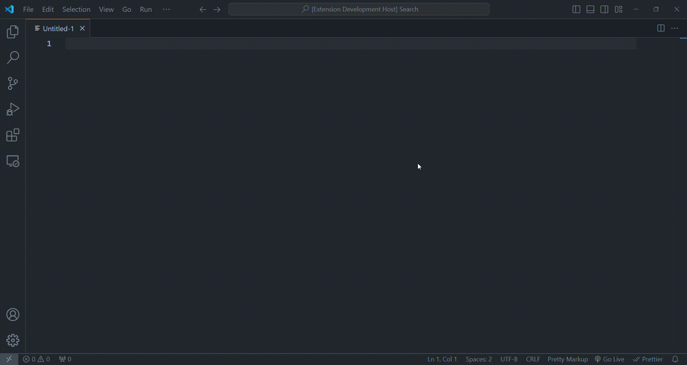

# Pretty Markup Language Basic

This tool extends VS Code with support for the Pretty Markup preprecessor, and provides basic but effective intellisense for editing and refactoring markup files.

## Features
### Snippets
The snippets are helpful to get started with a new markup. 

# 
### Intellisense
The intellisense brings good leads to understand how the markups are inputed in a document and help the developer.

> Tip: Many popular extensions utilize animations. This is an excellent way to show off your extension! We recommend short, focused animations that are easy to follow.

## Release Notes

### 1.0.0 - Initial release of Pretty Markup Language Basic

## For more information

* [Pretty Markup on npm](https://www.npmjs.com/package/pretty-markup)
* [Pretty Markup on Github](https://github.com/mopires/pretty-markup)

**Enjoy!**
