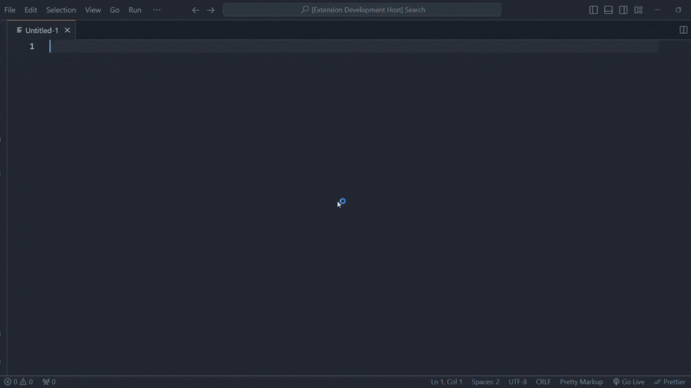

# Pretty Markup Language Basic

This tool extends VS Code with support for the Pretty Markup preprecessor, and provides basic but effective intellisense for editing and refactoring markup files.

## Features
### 🤵🏻‍♂️ Snippets
The snippets are helpful to get started with a new markup. 

# 
### 🤵🏼‍♀️ Intellisense
The intellisense brings good leads to understand how the markups are inputed in a document and help the developer.

## 🔧 Issues and improvements 
Report bugs or improvements at https://github.com/mopires/pretty-markup-language-basics/issues

## Release Notes

### 0.0.1 - Initial release of Pretty Markup Language Basic
### 0.0.2 - Fix gif in readme

## For more information

* [Pretty Markup on npm](https://www.npmjs.com/package/pretty-markup)
* [Pretty Markup on Github](https://github.com/mopires/pretty-markup)

**Enjoy!**
